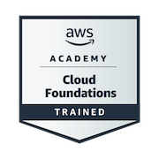
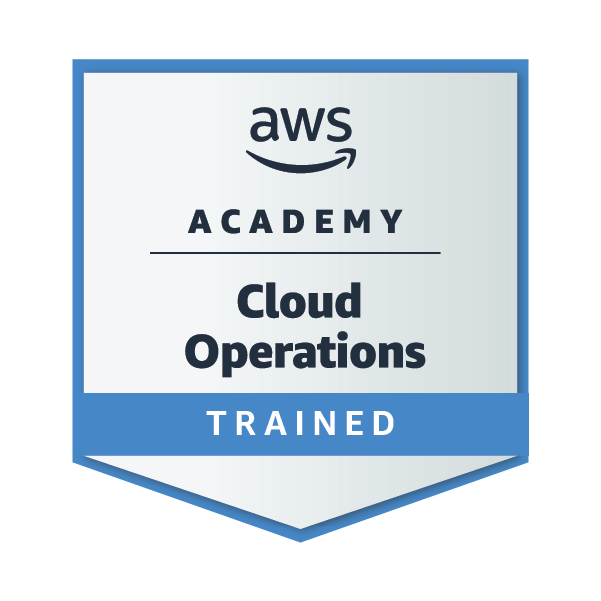
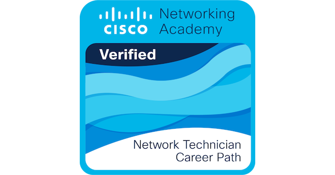
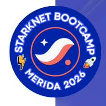

# Hi, I'm Diego Ramirez Magana

### Software Engineering and Digital Business student

Backend, product development, automation and cloud-connected applications.

## About Me

<ul>
  <li>Software Engineering and Digital Business student based in Merida, Mexico.</li>
  <li>Focused on backend systems, mobile apps, product validation and cloud-connected tools.</li>
  <li>Java is my strongest language; I also build with Python, Kotlin, JavaScript and .NET.</li>
  <li>AWS Academy training, Cisco Networking Academy training and IEEE member.</li>
</ul>

## Technologies

<table>
  <tr>
    <td></td>
    <td align="center"><strong>Java</strong></td>
  </tr>
  <tr>
    <td></td>
    <td align="center"><strong>Python</strong></td>
  </tr>
  <tr>
    <td></td>
    <td align="center"><strong>Kotlin</strong></td>
  </tr>
  <tr>
    <td></td>
    <td align="center"><strong>JavaScript</strong></td>
  </tr>
  <tr>
    <td></td>
    <td align="center"><strong>Spring Boot</strong></td>
  </tr>
  <tr>
    <td></td>
    <td align="center"><strong>FastAPI</strong></td>
  </tr>
  <tr>
    <td></td>
    <td align="center"><strong>React</strong></td>
  </tr>
  <tr>
    <td></td>
    <td align="center"><strong>Electron</strong></td>
  </tr>
  <tr>
    <td></td>
    <td align="center"><strong>.NET</strong></td>
  </tr>
  <tr>
    <td></td>
    <td align="center"><strong>Android / Room / MVVM</strong></td>
  </tr>
  <tr>
    <td></td>
    <td align="center"><strong>PostgreSQL</strong></td>
  </tr>
  <tr>
    <td></td>
    <td align="center"><strong>Supabase / RLS</strong></td>
  </tr>
  <tr>
    <td></td>
    <td align="center"><strong>MySQL</strong></td>
  </tr>
  <tr>
    <td></td>
    <td align="center"><strong>SQLite</strong></td>
  </tr>
  <tr>
    <td></td>
    <td align="center"><strong>Amazon AWS</strong></td>
  </tr>
  <tr>
    <td></td>
    <td align="center"><strong>Cloudflare Pages</strong></td>
  </tr>
  <tr>
    <td></td>
    <td align="center"><strong>Cairo / StarkNet</strong></td>
  </tr>
  <tr>
    <td></td>
    <td align="center"><strong>Streamlit</strong></td>
  </tr>
  <tr>
    <td></td>
    <td align="center"><strong>Linux</strong></td>
  </tr>
  <tr>
    <td></td>
    <td align="center"><strong>Kali Linux</strong></td>
  </tr>
  <tr>
    <td></td>
    <td align="center"><strong>Cisco Packet Tracer</strong></td>
  </tr>
  <tr>
    <td></td>
    <td align="center"><strong>Git</strong></td>
  </tr>
</table>

## Certifications

  
  
  
  
  

## Professional Focus

<ul>
  <li>Backend APIs with Java, Spring Boot, Python and FastAPI.</li>
  <li>Mobile and desktop business tools with Kotlin, Electron, React and SQLite.</li>
  <li>Cloud-connected products using Supabase, Cloudflare Pages and AWS training foundations.</li>
  <li>Project documentation, testing, repository cleanup and responsible publication practices.</li>
</ul>

## Projects

<ul>
  <li><strong><a href="https://github.com/epinki07/-SistemaFacturacion">SistemaFacturacion</a></strong> - REST invoicing API with Spring Boot, JPA, H2, MapStruct, Swagger and service tests.</li>
  <li><strong><a href="https://github.com/epinki07/pos-restaurante">POS Restaurante</a></strong> - desktop POS system with Electron, React, SQLite, reports and 62 automated tests. Closed source.</li>
  <li><strong><a href="https://github.com/epinki07/FinanTrack">FinanTrack</a></strong> - Android finance app using Kotlin, Room, MVVM and .NET support modules. Closed source.</li>
  <li><strong><a href="https://github.com/epinki07/webtrack-2">WebTrack 2</a></strong> - product case study with a <a href="https://webtrack-2.pages.dev">public demo</a> and closed source implementation.</li>
  <li><strong><a href="https://github.com/epinki07/Pokedex-api">Pokedex API</a></strong> - REST API with Python, FastAPI and JSON data.</li>
  <li><strong><a href="https://github.com/epinki07/market-backend-2026-3-b">Market Backend</a></strong> - Spring Boot backend with JPA, MapStruct and OpenAPI documentation.</li>
  <li><strong><a href="https://github.com/epinki07/SQAD">SQAD</a></strong> - food quality control system with Java, OOP and CSV persistence.</li>
  <li><strong><a href="https://github.com/epinki07/conecta4">Conecta 4</a></strong> - algorithm project using MinMax and Alpha-Beta pruning in Python.</li>
</ul>

High-value product codebases are closed source. Their public repositories exist as portfolio showcases with summaries, demos or evidence, while implementation details remain private.

## Activity

  
  

## Use and rights

My public repositories and portfolio are shared for professional review and learning reference only. Unless a repository explicitly includes a license, all rights are reserved and no permission is granted to copy, redistribute, sell, sublicense or reuse the code, design, text, certificates or project materials as the base for another portfolio, product or academic delivery.

## Thank you for your interest in my profile.

